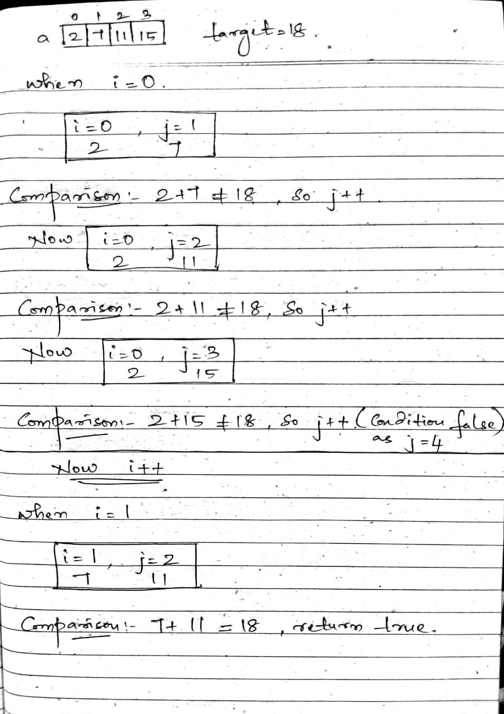
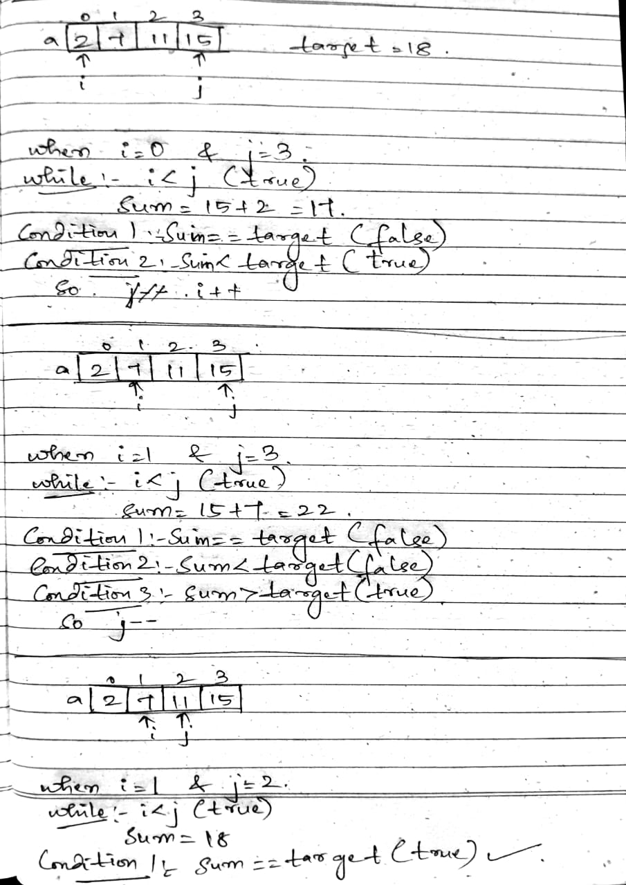
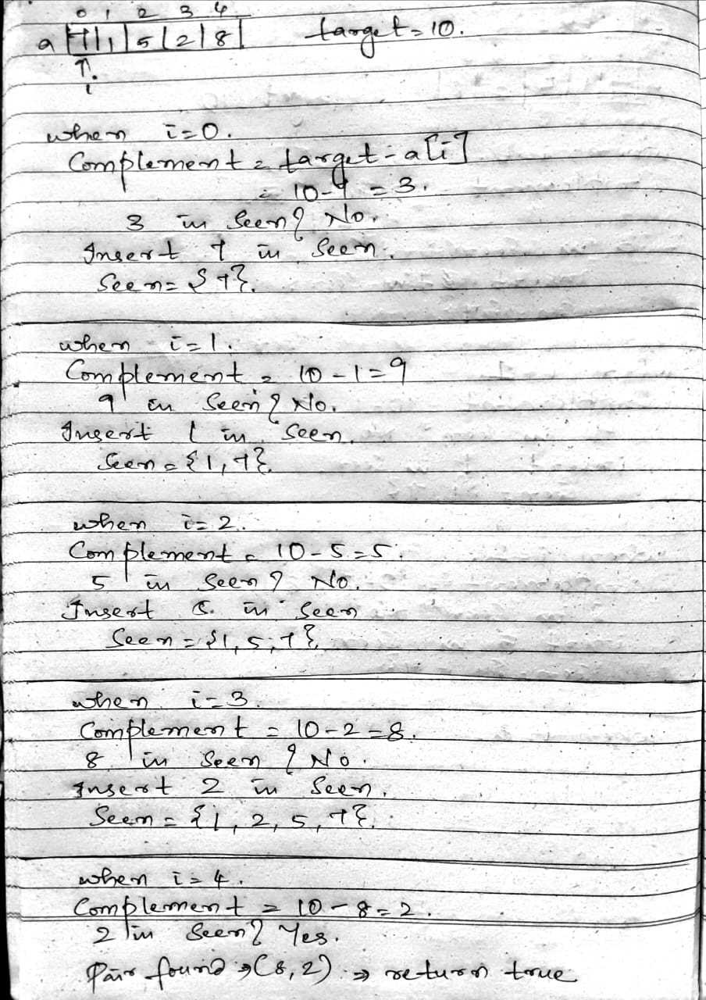

# Concept

## What is two pointers technique

Two Pointers is a technique where two variables (pointers) are used to traverse data structures efficiently to solve problems, especially involving searching, sorting, and subarray problems.

## Why?

Two pointers are used to solve problems efficiently by eliminating the need for nested loops used in brute force approaches.

## When to use?

* It is mainly used to solve linear data structure problems like arrays and linked lists efficiently.
* Two Pointers works on both sorted and unsorted arrays, but in sorted arrays, it often gives more optimized solutions (like avoiding hash maps or sorting manually).

## A) Template for Brute force for sorted array - O(n^2)

``` c++
for (int i = 0; i < arr.size(); i++) {
    for (int j = i + 1; j < arr.size(); j++) {
        // check condition on arr[i], arr[j]
    }
}
```

### Example for Brute force for sorted array - Checking if there exists a pair in the array whose sum is equal to a given target

```c++
int main(){
    vector<int>a = {2,7,11,15};
    int target = 18;
    for(int i=0;i<a.size();i++)
    {
        for(int j=i+1;j<a.size();j++)
        {
            if(a[i]+a[j]==target)
            {
                return true;
            }
        }
    }
    return false;
}
```



## B) Template for optimized solution for sorted array - O(n) (Here hash set can also be used)

```c++
int left = 0;
int right = arr.size() - 1;

while (left < right) {
    int sum = arr[left] + arr[right];

    if (sum == target) {
        // Do something
    } else if (sum < target) {
        left++;
    } else {
        right--;
    }
}
```



### Example for Optimized solution for sorted array - Checking if there exists a pair in the array whose sum is equal to a given target

```c++
int main(){
    vector<int>a = {2,7,11,15};
    int target = 18;
    int left = 0, right = a.size()-1;
    while (left<right)
    {
        int sum = a[left]+a[right];
        if(sum == target) return true;
        else if(sum<target) left++;
        else right--;
    }
    return false;
}
```

## C) Template for Brute force for unsorted array - This works for both sorted and unsorted array - O(n^2)

```c++
sort(a.begin(),a.end()); // optional

for (int i = 0; i < arr.size(); i++) {
    for (int j = i + 1; j < arr.size(); j++) {
        if (arr[i] + arr[j] == target) {
            // Pair found
        }
    }
}
```

## D) Template for optimized solution for unsorted array - O(n)

```c++
unordered_set<int> seen;

for (int i = 0; i < arr.size(); i++) {
    int complement = target - arr[i];
    if (seen.count(complement)) {
        // Do something (e.g., return true)
    }
    seen.insert(arr[i]);
}
```

The above template is used only to check the existence -> unordered_set is used

or

```c++
#include <iostream>
#include <vector>
#include <unordered_map>
using namespace std;

void runTwoSum() {
    vector<int> nums = {1, 3, 4, 2};  // array initialized here
    int target = 6;

    unordered_map<int, int> mp;  // value → index

    for (int i = 0; i < nums.size(); i++) {
        int complement = target - nums[i];

        if (mp.find(complement) != mp.end()) {
            cout << "Indices: " << mp[complement] << ", " << i << endl;
            cout << "Values: " << nums[mp[complement]] << ", " << nums[i] << endl;
            return;
        }

        mp[nums[i]] = i;
    }

    cout << "No pair found" << endl;
}

```

The above template is used to store key value pairs -> unordered_map is used

* We use a hash set so that values can be quickly compared and looked up in constant time (O(1)) using the hash table.



### Difference b/w count() and find()

* count() - when you don’t need to access the element — just want to know if it’s there.
* find() - Slightly more flexible: you can use the iterator to access the element if needed.

## Types of two pointers

### 1. Opposite Direction (Left & Right Pointers)

* Use when: The array is sorted
* Why: Helps efficiently find pairs or optimize space usage

```c++
int left = 0, right = arr.size() - 1;
while (left < right) {
    int sum = arr[left] + arr[right];
    if (sum == target) return true;
    else if (sum < target) left++;
    else right--;
}
```

### 2. Same Direction (Sliding Window)

* Use when: You're working with subarrays or conditions within a window
* Why: Helps solve problems in O(n) without extra space

```c++
int left = 0;
for (int right = 0; right < arr.size(); right++) {
    // expand window
    while (condition not met) {
        // shrink from left
        left++;
    }
    // update result
}
```

or

```c++
int maxSumOfWindowK(vector<int>& arr, int k) {
    int left = 0, sum = 0, maxSum = 0;

    for (int right = 0; right < arr.size(); right++) {
        sum += arr[right];  // expand window

        if (right - left + 1 == k) {
            maxSum = max(maxSum, sum);  // update max
            sum -= arr[left];  // shrink window
            left++;
        }
    }

    return maxSum;
}
```

### Example for sliding window

```c++
int main(){
    vector<int>a = {2,1,5,1,3};
    int left = 0,sum=0, maxSum=0,k=2;
    for(int right=0;right<a.size();right++)
    {
        sum = sum+a[right];
        if(right-left+1==k)
        {
            maxSum = max(maxSum, sum);
            sum = sum-a[left];
            left++;
        }
    }
    cout<<maxSum;
}
```

### 3. Fixed Distance / Reversal

* Use when: You need to reverse, rotate, or process array sections

```c++
int left = 0, right = k - 1;
while (left < right) {
    swap(arr[left], arr[right]);
    left++;
    right--;
}
```

### Example for Reversal

```c++
void reverseArray(vector<int>& arr) {
    int left = 0, right = arr.size() - 1;

    while (left < right) {
        swap(arr[left], arr[right]);
        left++;
        right--;
    }
}
```

Detailed sliding window will be in another file

### 4. Two Arrays / Merging

* Use when: Working with two sorted arrays
* Why: Efficiently merge or find common elements

```c++
int i = 0, j = 0;
while (i < arr1.size() && j < arr2.size()) {
    if (arr1[i] < arr2[j]) i++;
    else if (arr1[i] > arr2[j]) j++;
    else {
        // match or merge logic
        i++; j++;
    }
}
```

### Example for Two Arrays - Find common elements in 2 arrays (brute force)

```c++
int main(){
    vector<int>a1 = {1,3,4,5,7};
    vector<int>a2 = {2,3,5,6};
    for(int i=0;i<a1.size();i++)
    {
        for(int j=0;j<a2.size();j++)
        {
            if(a1[i]==a2[j])
            {
                cout<<a1[i]<<" ";
            }
        }
    }
}
```

### Example for Two Arrays - Find common elements in 2 arrays (optimized)

```c++
int main(){
    vector<int>a1 = {1,3,4,5,7};
    vector<int>a2 = {2,3,5,6};
    int i=0,j=0;
    while(i<a1.size() && j<a2.size())
    {
        if(a1[i]<a2[j]) 
        {
            i++;
        }
        if(a1[i]>a2[j])
        {
            j++;
        }
        else
        {
            cout<<a1[i]<<" ";
            i++;
            j++;
        }

    }
}
```

### 5. Fast & Slow (Tortoise & Hare)

* Use when: You want to track cycles, remove duplicates, etc.

```c++
int slow = 0;
for (int fast = 1; fast < arr.size(); fast++) {
    if (arr[fast] != arr[slow]) {
        slow++;
        arr[slow] = arr[fast];
    }
}
```
