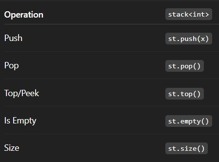

# Concept

## What is a stack

A linear data structure which follows the principle LIFO (last in first out).

## Use cases

1. Undo and redo operations
2. Validating the paranthesis
3. Browser back/forward and history

## When to use stack

Use a stack when you need to remember and access the most recent item first

## Operations and its Time Complexity

Push - O(1)
Pop  - O(1)
Peek/Top - O(1)

## Declaring Stack

```c++
stack<int>st;
```

